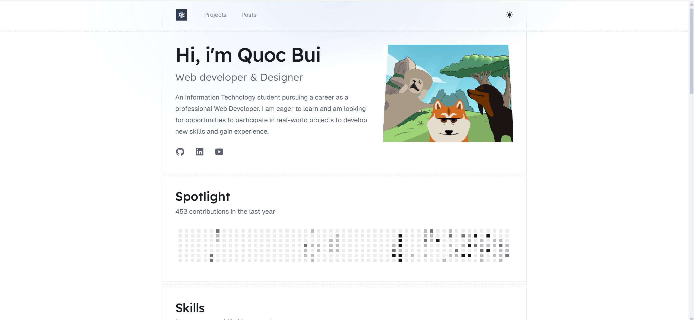

# Portfolio



## Quick Start

```bash
# Installing dependencies
pnpm install

# Development mode
pnpm dev

# Building
pnpm build
```

## Technology Stack

- **Framework**: Astro.js
- **Styling**: Tailwind CSS
- **Language**: TypeScript
- **Component**: React or Astro.js
- **Icons**: Iconify
- **Search**: Pagefind

## Configuration

The main configuration is located in `src/config.ts`, which includes site information, post configuration, project display, etc.

## License

MIT License